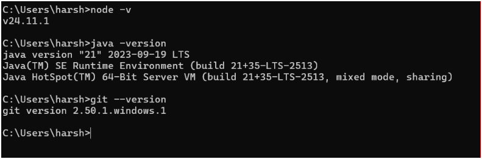
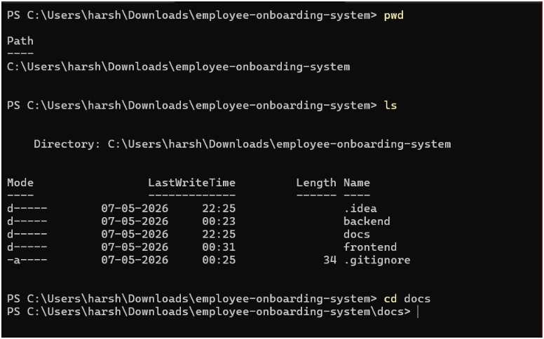
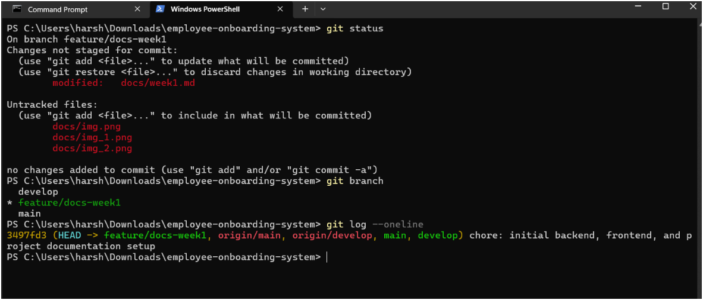
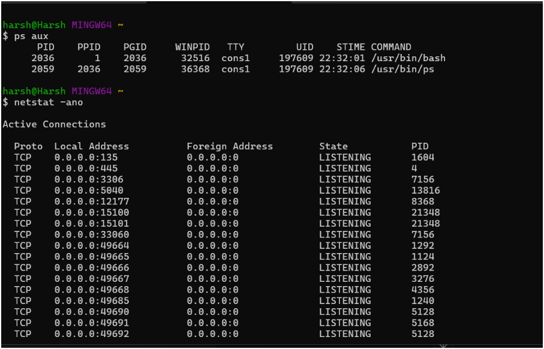
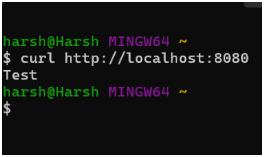

# Week 1

## Agile and Scrum

## Sprint 1 Goal

### Build the foundational HR/Admin functionalities for managing employee onboarding.

### HR1 : HR/Admin Login
#### User Story : As an HR/Admin, I want to log into the onboarding portal, so that I can access the HR dashboard
#### Acceptance criteria:

- HR/Admin can log in using valid email & password.
- Invalid credentials should display an error message.
- Email field must follow proper email validation.
- Password filed can’t be empty.
- Successful login redirects to the HR dashboard.

### HR2 : Employee Account creation
#### User Story: As an HR/Admin, I want to create employee accounts, So that employees can access the onboarding portal.
#### Acceptance Criteria:

- HR/Admin can enter employee name , email and DOB
- Email must follow proper email format validation.
- Required fields should not be empty.
- Duplicate employee email should not be allowed.
- Employee account should be successfully stored in the database.
- Newly created employee should appear in the employee list.

### HR3 : View Employee List
#### User Story: As an HR/Admin, I want to view the list of employees, So that I can track onboarding progress and manage employee records.
#### Acceptance Criteria: 

- HR/Admin can view all registered employees.
- Employee list should display name , email and onboarding status.
- Employees list should support pagination for large datasets.
- HR/Admin can click on an employee to view detailed information.
- Employee onboarding progress should be visible in employee details.
- Employee data should load successfully from the database.

## Sprint 1 Backlog

| Story ID | Story Name |
|----------|-------------|
| HR1 | HR/Admin Login |
| HR2 | Employee Account Creation |
| HR3 | View Employee List |

## Development Environment Setup

### Installed Tools

1. VS Code
2. IntelliJ IDEA
3. Git
4. Node.js
5. Java
6. Postman
7. Docker

## Basic Linux and Debugging Commands

